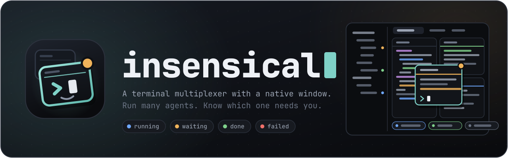

<h1 align="center">
  
</h1>

A terminal multiplexer with a native window, for running many terminals and coding
agents and knowing which of them needs you. Linux and macOS.
<https://insensical.com>

This repository holds the releases. [`MANUAL.md`](MANUAL.md) is the manual, and
[`CHANGELOG.md`](CHANGELOG.md) says what each release changed.

## Installing

Every file named here is on the [latest release](../../releases/latest).

**Arch Linux**, from the AUR:

```sh
yay -S insensical-bin
```

**Debian 12 and later, Ubuntu 24.04 and later**, on x86-64:

```sh
sudo apt install ./insensical_*_amd64.deb
```

**Other Linux**, on x86-64 with glibc 2.36 or later: unpack
`insensical-*-x86_64-unknown-linux-gnu.tar.gz` and put `insensical` and `isc` in the same
directory on your `PATH`. The desktop entry, the icon, a user unit and completions for bash, zsh and fish are beside them.

**A Linux machine with no desktop**, on x86-64: `isc-x86_64-linux` is `isc` by itself,
which is the daemon, the command line and the interface in a terminal. It is one file
that needs nothing installed, on any distribution:

```sh
cd "$(mktemp -d)"
curl -fLO https://github.com/mah3uz/insensical-release/releases/latest/download/isc-x86_64-linux -O https://github.com/mah3uz/insensical-release/releases/latest/download/isc-x86_64-linux.sha256
sha256sum -c isc-x86_64-linux.sha256 && install -m755 isc-x86_64-linux ~/.local/bin/isc
isc
```

The third line installs the file only if it matches its checksum.

**macOS 13 and later, on Apple silicon**, with Homebrew:

```sh
brew install --cask mah3uz/tap/insensical
```

or open `insensical-*-aarch64-apple-darwin.dmg` and drag the application to
Applications. It is not signed with a Developer ID, so macOS refuses to open a copy
that was downloaded until you run:

```sh
xattr -dr com.apple.quarantine /Applications/insensical.app
```

Homebrew does that for you. There is no build for a Mac with an Intel processor.

The window draws its own icons, so any font works in it; the default is JetBrainsMono
Nerd Font. The interface in a terminal needs a Nerd Font in the terminal you run it in,
unless that terminal carries those icons itself, as Ghostty, kitty and WezTerm do.

## Checking a download

Each file has a `.sha256` beside it: `sha256sum -c insensical-*.sha256`. A file and its
checksum come from the same release, so this catches a download that was cut short or
damaged, and does not tell you that the release itself is the right one.
